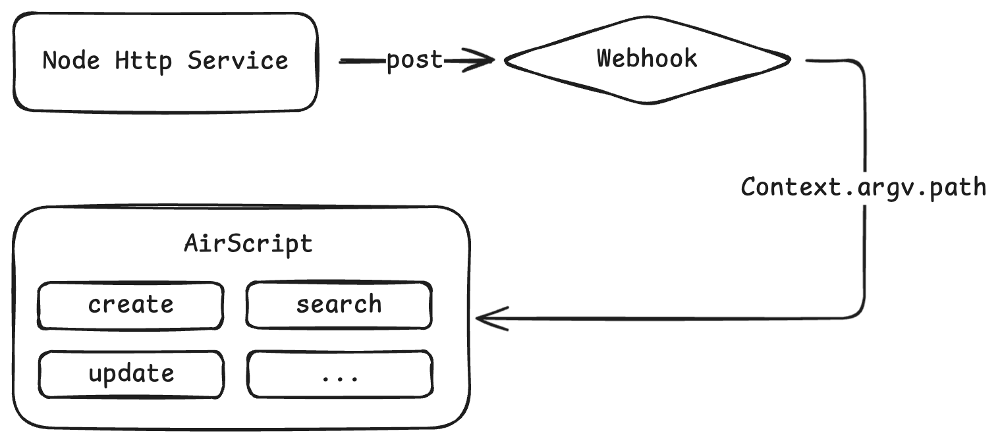

# wps-airscript-router

WPS AirScript路由应用框架，适用于复杂的webhook调用。



## 搭配Node环境使用
```bash
npm install --save wps-airscript-router
```

```javascript
import AppFactory from 'wps-airscript-router'

// 统一配置路由
const app = AppFactory.createApp([
    { path: 'index', handle: () => 'index response' }
])

// 单独新增路由
app.route('test', () => 'test response')

// 配置默认处理
app.setDefaultHandle(() => 404)

// 配置错误处理
app.setErrorHandle((_error: any) => 500)

const bootstrap = () => {
    const { method } = Context.argv;
    const handle = app.getHandle(method);
    return handle();
}

export default bootstrap()
```

## 直接在AirScript中使用
1. 将dist/index.js中的代码复制到airscript脚本编辑器第一行
2. 新增以下代码
```javascript
const app = AppFactory.createApp()

// 定义一条路由
app.route('index', () => 'index response')

// path是http调用webhook时传入的body参数
const { path } = Context.argv;
const handle = app.getHandle(path);

// return保证http调用webhook有返回值
return handle();
```